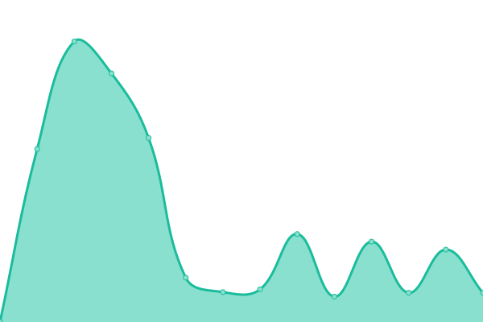

# [📈 Live Status](https://ask4physics.github.io/upptime): <!--live status--> **🟥 Complete outage**

This repository contains the open-source uptime monitor and status page for [MDIS OPAC](https://mdis.spydus.com.sg/), powered by [Upptime](https://github.com/upptime/upptime).

With [Upptime](https://upptime.js.org), you can get your own unlimited and free uptime monitor and status page, powered entirely by a GitHub repository. We use [Issues](https://github.com/force11/uptime/issues) as incident reports, [Actions](https://github.com/ask4physics/upptime/actions) as uptime monitors, and [Pages](https://ask4physics.github.io/upptime) for the status page.

<!--start: status pages-->
<!-- This summary is generated by Upptime (https://github.com/upptime/upptime) -->
<!-- Do not edit this manually, your changes will be overwritten -->
<!-- prettier-ignore -->
| URL | Status | History | Response Time | Uptime |
| --- | ------ | ------- | ------------- | ------ |
|  [MDIS OPAC.](https://mdis.spydus.com.sg/) | 🟥 Down | [mdis-opac.yml](https://github.com/ask4physics/upptime/commits/HEAD/history/mdis-opac.yml) | 

 0ms
     
 | 

<a href="https://ask4physics.github.io/uptime/history/mdis-opac">0.00%</a>
    

<!--end: status pages-->

[**Visit our status website →**](https://ask4physics.github.io/upptime)

## 📄 License

- Powered by: [Upptime](https://github.com/upptime/upptime)
- Code: [MIT](./LICENSE) © [MDIS OPAC](http://mdis.spydus.com.sg/)
- Data in the `./history` directory: [Open Database License](https://opendatacommons.org/licenses/odbl/1-0/)
